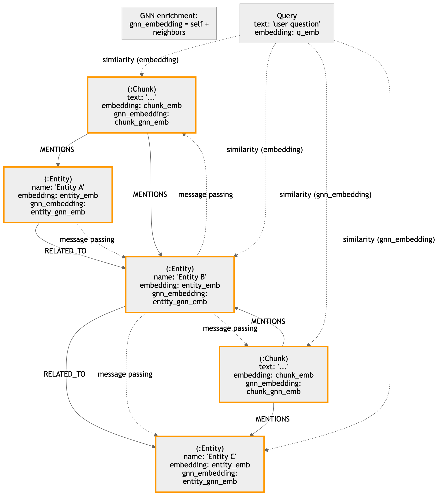

# GraphRAG для юридического поиска: Архитектура и ТЗ (MVP)

## 1. Цели, бизнес-контекст, ограничения MVP

### 1.1 Цели
- Построить MVP-систему GraphRAG для юридических и регуляторных документов.
- Реализовать гибридный retrieval: `BM25 + GNN`.
- Внедрить многоуровневую дедупликацию (exact + semantic + graph-context).
- Обеспечить обязательную атрибуцию источников до уровня `doc/page/span`.

### 1.2 Бизнес-контекст
- В юридическом домене критично не пропускать релевантные нормы и источники.
- Система должна быть объяснимой и трассируемой.
- Дубликаты и версии документов ухудшают полноту и точность выдачи.

### 1.3 Ограничения MVP
- Масштаб: до `1 000 000` чанков.
- Языки: `RU + EN`.
- Источники: `PDF`, `DOCX`, `HTML`.
- OCR сканов вне MVP.
- Локальный запуск через `Docker Compose`.
- p95 retrieval+context-build: до `10 секунд`.

---

## 2. C4-контейнеры и поток данных

### 2.1 Контейнеры (C4 Level 2)
1. `API Service`
- REST API: `/index/documents`, `/index/jobs/{job_id}`, `/retrieve`, `/answer-context`, `/health`, `/metrics`.

2. `Indexing Worker`
- Парсинг документов, чанкинг, извлечение сущностей и ссылок на нормы.
- Дедупликация и каноникализация.
- Запись в OpenSearch и Neo4j.

3. `OpenSearch (Evidence/Text Store)`
- Хранение чанков и метаданных цитирования.
- BM25-индекс и фильтрация.

4. `Neo4j (Entity Graph Store)`
- Graph-of-record для сущностей и связей.
- В режиме `neo4j_native`: также хранение `Chunk`-узлов, BM25 (fulltext) и vector retrieval.

5. `Qdrant (Vector Store)`
- Хранение векторов для semantic similarity и GNN.
- Коллекции для `chunk/text embeddings` и `entity node embeddings`.
- Опционален в режиме `neo4j_native`.

6. `Queue`
- Асинхронная обработка батчей индексации.

7. `Object Storage (логический компонент MVP)`
- Оригинальные файлы и служебные артефакты.

### 2.2 Поток индексации
1. Клиент вызывает `POST /index/documents`.
2. API создает `job_id`, публикует задачи в очередь.
3. Worker парсит текст, делает чанкинг и нормализацию.
4. Выполняется дедуп (exact -> semantic -> graph-context).
5. Запись:
- в OpenSearch: чанки + provenance (`doc/page/span`),
- в Neo4j: сущности/нормы/отношения; в `neo4j_native` дополнительно `Chunk`-узлы с `embedding` и `gnn_embedding`,
- в Qdrant: `text embeddings` и `entity embeddings` с version-тегами.
6. `GET /index/jobs/{job_id}` отдает статус и дедуп-статистику.

### 2.3 Поток retrieval
1. Клиент вызывает `POST /retrieve`.
2. Параллельный candidate retrieval:
- в режиме `external`: BM25 по OpenSearch + векторный поиск в Qdrant (text/entity),
- в режиме `neo4j_native`: BM25 через Neo4j fulltext index + vector ANN через Neo4j vector index,
- GNN scoring на entity-графе Neo4j.
3. Fusion scoring кандидатов.
4. Dedup-aware merge.
5. Финальный выбор evidence-чанков из OpenSearch (`external`) или Neo4j `Chunk` (`neo4j_native`) с обязательными цитатами.

---

## 3. Формальная модель данных

### 3.1 OpenSearch (текст и доказательная база)
Индекс `legal_chunks`:
- `chunk_id` (keyword)
- `doc_id` (keyword)
- `version_id` (keyword)
- `section_id` (keyword)
- `text` (text, BM25)
- `normalized_text` (text)
- `language` (keyword)
- `jurisdiction` (keyword)
- `source_type` (keyword)
- `is_canonical` (boolean)
- `page` (integer)
- `span_start` (integer)
- `span_end` (integer)
- `effective_date` (date)
- `exact_hash` (keyword)
- `entity_ids` (keyword[]) — ссылки на сущности из Neo4j

### 3.2 Neo4j (сущности/отношения + опционально Chunk в `neo4j_native`)
Узлы:
- `(:Entity {entity_id, type, value, normalized_value, aliases, confidence, embedding, embedding_model, embedding_version, gnn_embedding, gnn_model_version, gnn_updated_at, first_seen_at, last_seen_at})`
- `(:Chunk {chunk_id, doc_id, version_id, section_id, text, normalized_text, language, jurisdiction, is_canonical, page, span_start, span_end, filename, source_uri, source_type, mime_type, file_hash, ingestion_job_id, ingested_at, effective_date, embedding, embedding_model, embedding_version, gnn_embedding, gnn_model_version, gnn_updated_at})` — только в `neo4j_native`.

Ребра:
- `(:Chunk)-[:MENTIONS]->(:Entity)`
- `(:Entity)-[:RELATED_TO]->(:Entity)`

Примечание:
- В режиме `external` `Chunk` хранится в OpenSearch/Qdrant.
- В режиме `neo4j_native` evidence-модель chunk-centric: `Chunk` является узлом графа.

### 3.3 Версионность и каноничность
- Версионность задается полями `version_id` и `is_canonical` на `Chunk`.
- История изменений фиксируется на уровне метаданных ingestion.
- По умолчанию retrieval работает с `is_canonical=true`.

### 3.4 Vector Storage Strategy
Типы векторов:
- `text_embedding` (query/chunk semantic similarity):
  - назначение: semantic сигнал в fusion и near-duplicate сравнение;
  - хранение: в Qdrant (`external`, коллекция `legal_chunk_vectors`) или в Neo4j поле `Chunk.embedding` + `VECTOR INDEX` (`neo4j_native`);
  - payload: `chunk_id`, `doc_id`, `version_id`, `language`, `jurisdiction`, `is_canonical`, `embedding_model`, `embedding_version`;
  - обновление: переиндексация батчами при смене embedding-модели.

- `entity_node_features` (входные признаки для GNN):
  - назначение: признаки узлов `Entity` для GraphSAGE;
  - хранение: в Qdrant (`external`) либо напрямую в Neo4j (`Entity.embedding`) в `neo4j_native`.

- `entity_node_embedding` (выход GNN inference):
  - назначение: быстрый retrieval по графовому пространству;
  - хранение: в Qdrant (`external`, `legal_entity_vectors`) или в Neo4j (`Entity.gnn_embedding`, `Chunk.gnn_embedding`) в `neo4j_native`.

Правило MVP:
- Поддерживаются 2 режима: `external` и `neo4j_native` (переключатель `retrieval.backend`).
- `external`: Neo4j как graph-of-record, OpenSearch для lexical/evidence, Qdrant для рабочих векторов.
- `neo4j_native`: BM25 и vector retrieval выполняются внутри Neo4j; OpenSearch/Qdrant становятся опциональными.

---

## 4. Алгоритм дедупликации

### 4.1 Стадия 1: Exact dedup
- Нормализация текста.
- `exact_hash = SHA256(normalized_text)`.
- Совпадение hash => exact duplicate.

### 4.2 Стадия 2: Semantic near-duplicate
- Embedding для чанка.
- Косинус с существующими каноническими чанками.
- Порог MVP: `cosine >= 0.92`.

### 4.3 Стадия 3: Graph-context dedup
- Сравнение извлеченных сущностей/норм и их neighborhood в графе.
- Near-duplicate подтверждается только при графовом согласовании.

### 4.4 Conflict resolution
- Канонический кандидат выбирается по:
  1. более свежему `effective_date`,
  2. при равенстве — по приоритету источника.
- Неуверенные случаи: `review_required`.

### 4.5 Audit trail
Логируются:
- входные id,
- similarity-метрики,
- итоговое решение,
- сработавшее правило.

---

## 5. Алгоритм гибридного retrieval (GNN + BM25)

### 5.1 Candidate generation
- `external`: BM25 из OpenSearch (`k_bm25=100`) + vector retrieval по chunk/entity-эмбеддингам в Qdrant (`k_vec=100`) + GNN (`k_gnn=100`).
- `neo4j_native`: BM25 через `db.index.fulltext.queryNodes` по `Chunk` (`k_bm25=100`) + vector ANN через `db.index.vector.queryNodes` по `Chunk`/`Entity` (`k_vec=100`) + GNN (`k_gnn=100`).
- Semantic similarity query<->chunk рассчитывается по активному backend векторов.

### 5.2 Fusion scoring
`S = 0.45 * norm(BM25) + 0.35 * norm(GNN) + 0.20 * norm(semantic_similarity)`

### 5.3 Entity-to-evidence mapping
- GNN возвращает релевантные сущности/нормы.
- `external`: через `entity_ids` подбираются подтверждающие чанки из OpenSearch.
- `neo4j_native`: через связь `(:Chunk)-[:MENTIONS]->(:Entity)` подбираются `Chunk` непосредственно из Neo4j.

### 5.4 Dedup-aware merge и diversity
- Удаление near-duplicate кандидатов.
- Выбор наиболее свежего канонического evidence.
- Diversity: не более `max_chunks_per_doc=3` до `top_n=12`.

### 5.5 Output contract
Для каждого результата:
- `score_breakdown`: BM25, GNN, semantic, fusion.
- `citations`: `doc_id`, `section_id`, `page`, `span_start`, `span_end`.

---

## 6. API-контракты

### 6.1 `POST /index/documents`
Назначение: запуск батч-индексации.

Пример request:
```json
{
  "documents": [
    {
      "external_id": "law-123",
      "source_type": "pdf",
      "language": "ru",
      "title": "Федеральный закон ...",
      "content_uri": "s3://bucket/law-123.pdf",
      "metadata": {"jurisdiction": "RU"}
    }
  ]
}
```

Пример response:
```json
{
  "job_id": "idx_20260317_0001",
  "status": "queued"
}
```

Идемпотентность: `Idempotency-Key`.

### 6.2 `GET /index/jobs/{job_id}`
Назначение: статус и дедуп-метрики.

Пример response:
```json
{
  "job_id": "idx_20260317_0001",
  "status": "running",
  "processed": 120,
  "failed": 2,
  "dedup_stats": {
    "exact_duplicates": 30,
    "near_duplicates": 14,
    "graph_confirmed_duplicates": 9,
    "review_required": 3
  },
  "errors": []
}
```

### 6.3 `POST /retrieve`
Назначение: выдача evidence-чанков с объяснимым скорингом.

Пример request:
```json
{
  "query": "какие требования к хранению персональных данных",
  "language": "ru",
  "filters": {
    "jurisdiction": "RU",
    "is_canonical": true
  },
  "k": 12
}
```

Пример response:
```json
{
  "query_id": "q_001",
  "results": [
    {
      "chunk_id": "ch_1",
      "text": "...",
      "score_breakdown": {
        "bm25": 0.81,
        "gnn": 0.72,
        "semantic": 0.69,
        "fusion": 0.75
      },
      "citations": [
        {
          "doc_id": "law-123",
          "section_id": "sec-5",
          "page": 14,
          "span_start": 120,
          "span_end": 330
        }
      ]
    }
  ]
}
```

### 6.4 `POST /answer-context`
Назначение: собрать context pack для LLM только из подтвержденных evidence.

### 6.5 `GET /health` и `GET /metrics`
- `/health`: состояние API и зависимостей.
- `/metrics`: latency, throughput, errors, dedup counters, offline Recall@k.

### 6.6 Ошибки
- `400`, `404`, `409`, `422`, `500`, `503`.

### 6.7 SLA
- p95 retrieval+context-build <= 10 секунд.

---

## 7. План реализации (E1-E5)

### E1. Каркас и инфраструктура
- Docker Compose: `api`, `worker`, `opensearch`, `neo4j`, `qdrant`, `queue`.
- Health checks и конфигурация окружения.

Критерий: сервисы стабильно стартуют, `/health` валиден.

### E2. Ingestion + dual store index
- Парсинг PDF/DOCX/HTML.
- Запись чанков в OpenSearch.
- Запись сущностей/отношений в Neo4j.
- В режиме `neo4j_native`: запись `Chunk`-узлов в Neo4j с `embedding` и `gnn_embedding`.
- Запись text/entity векторов в Qdrant.

Критерий: для каждого чанка есть provenance, для сущностей есть graph-отношения.

### E3. Dedup + canonicalization
- Exact/semantic/graph-context дедуп.
- `DUPLICATE_OF`, `SUPERSEDES`, `is_canonical`.
- Audit trail.

Критерий: дедуп-статистика и воспроизводимые решения по конфликтам.

### E4. Hybrid retrieval
- BM25 + GNN candidate generation.
- Fusion scoring.
- Entity-to-evidence mapping.
- Dedup-aware merge и diversity.

Критерий: `POST /retrieve` возвращает `score_breakdown + citations`.

### E5. Quality gates
- Benchmark RU/EN (`Recall@10`, `Recall@20`).
- Нагрузочные тесты до 1M чанков.
- Метрики и отчеты качества.

Критерий: целевые latency и uplift против BM25 baseline.

---

## 8. Риски и меры

### 8.1 Ложные auto-merge при дедупе
- Меры: порог неопределенности, обязательное graph-context подтверждение, `review_required`.

### 8.2 Drift entity-графа
- Меры: переиндексация сущностей, регулярный пересчет графовых признаков.

### 8.3 Деградация Recall@k
- Меры: регрессионный benchmark перед релизом, canary-набор юридических запросов.

### 8.4 Рост latency
- Меры: лимиты кандидатов, кэш, профилирование OpenSearch/Neo4j-запросов.

---

## 9. Тест-план и критерии приемки

### 9.1 Юнит-тесты
- Нормализация текста и `exact_hash`.
- Near-duplicate классификация.
- Fusion scoring и tie-break.

### 9.2 Интеграционные
- Полный pipeline ingestion -> dedup -> dual store -> retrieve.
- Валидность цитирования `doc/page/span`.
- Проверка entity-to-evidence mapping.

### 9.3 Качество
- `Recall@10`, `Recall@20` на RU/EN.
- Сравнение BM25 baseline vs Hybrid GNN+BM25.

### 9.4 Нагрузочные
- Индекс до 1M чанков.
- p95 <= 10 сек при целевой конкурентности.

### 9.5 Definition of Done
- Реализованы обязательные API.
- Neo4j хранит сущности/отношения; в `neo4j_native` также `Chunk` с `embedding/gnn_embedding`.
- OpenSearch хранит evidence-чанки и отдает цитируемый текст в режиме `external`.
- Qdrant хранит text/entity embeddings в режиме `external`.
- Гибридный retrieval с объяснимыми score/citations проходит quality-гейты.

---

## 10. Принятые допущения
- Стек: Python 3.13, OpenSearch, Neo4j, Qdrant, Docker Compose.
- Embeddings: OpenAI API.
- OCR не входит в MVP.
- Cloud hardening отложен на следующую фазу.

---

## 11. Почему Neo4j и OpenSearch в этом проекте (сравнение с альтернативами)

### 11.1 Neo4j (вместо Memgraph / PostgreSQL-graph / NetworkX)
Преимущества для данного MVP:
- Зрелый property graph и Cypher для сложных traversals по сущностям и нормам.
- Удобная модель для `Version`, `SUPERSEDES`, `DUPLICATE_OF`, `RELATED_TO`.
- Легче реализовать explainability графовых связей в юридических кейсах.
- Возможность сконцентрировать retrieval внутри одного контура (`FULLTEXT` + `VECTOR INDEX`) в режиме `neo4j_native`.
- Ниже операционный риск для команды, чем у самодельного graph-слоя на SQL/файлах.

Почему не альтернативы на MVP:
- `Memgraph`: высокая производительность, но меньше зрелых практик/инструментов именно для mixed legal KG workflows.
- `PostgreSQL` + рекурсивные запросы: проще стек, но хуже выразительность и поддержка graph-алгоритмов.
- `NetworkX`: удобно для прототипа, но непригодно как основное хранилище при росте и многопоточном API.

### 11.2 OpenSearch (вместо Elasticsearch / PostgreSQL FTS / только vector DB)
Преимущества для данного MVP:
- Надежный BM25 из коробки для юридического keyword retrieval.
- Удобные фильтры по метаданным (`jurisdiction`, `language`, `is_canonical`, даты).
- Хорошая совместимость с гибридным pipeline и operational tooling.
- Подходит для роли evidence-store с быстрым доступом к chunk-текстам и цитатам.

Почему не альтернативы на MVP:
- `Elasticsearch`: близко по возможностям, но OpenSearch выбран как более предсказуемый вариант для открытого стека проекта.
- `PostgreSQL FTS`: может быть узким местом на росте корпуса и сложных retrieval-сценариях.
- Только vector DB: недостаточно для юридического lexical recall, где BM25 критичен.

### 11.3 Qdrant (вместо pgvector / Milvus / Weaviate)
Преимущества для данного MVP:
- Нативный векторный поиск с удобными payload-фильтрами для `language/jurisdiction/is_canonical`.
- Подходит для хранения и chunk embeddings, и entity embeddings в одном сервисе.
- Простой локальный запуск в Docker и предсказуемая эксплуатация для MVP.

Почему не альтернативы на MVP:
- `pgvector`: проще общий стек с Postgres, но ограничен по специализированным ANN-возможностям на росте.
- `Milvus`: мощно для high-scale, но выше операционная сложность для первой итерации.
- `Weaviate`: хорош как end-to-end векторная платформа, но в этом проекте выбран более модульный стек `OpenSearch + Neo4j + Qdrant`.

---

## 12. Диаграмма

