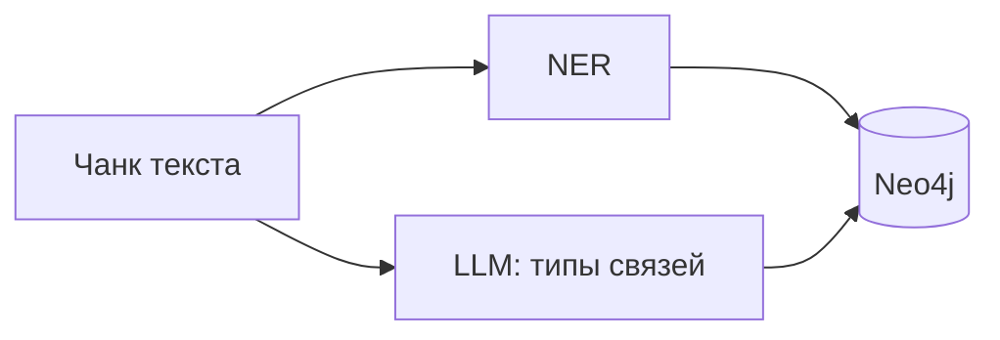
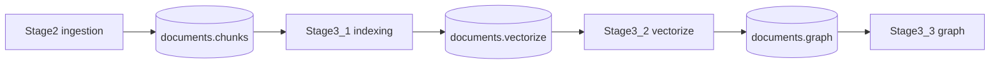
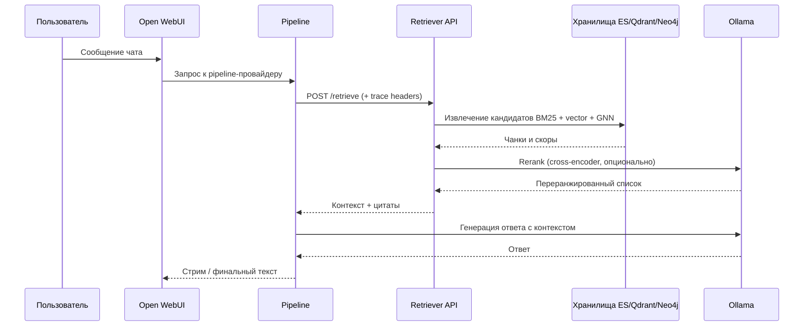

# GNN-Retriever: энциклопедический Graph RAG

Система предназначена для построения и использования **энциклопедического Graph RAG** в качестве базы знаний для ответов на вопросы по большому корпусу статей с **гибридным поиском** (лексика + векторы + графовый сигнал GNN), **прослеживаемыми цитатами** до уровня документа/фрагмента и **трассировкой** полного пути запроса.

## Предметная область и датасет

Корпус ориентирован на **структурированные энциклопедические тексты** (англоязычные статьи, заголовки, URL, метаданные). В качестве основного источника для прототипа используется потоковая выгрузка из **Hugging Face** (семейство датасетов в духе **Wikimedia / Wikipedia**): документы режутся на чанки с сохранением `title`, `url` и позиций в тексте — это задаёт «энциклопедический» характер знаний: сущности (люди, места, понятия), перекрёстные ссылки и тематическая связность.

| Аспект | Решение в проекте |
|--------|-------------------|
| Корпус | HF-датасет (streaming), лимиты и сплит через env |
| Чанкинг | Настраиваемый размер/перекрытие, события в Kafka |
| Граф | NER + **извлечение связей через LLM** (гибридный экстрактор) |
| Поиск | BM25 (Elasticsearch) + dense retrieval (Qdrant) + GNN по графу |
| Ответ | OWUI → pipeline → retriever API → rerank → LLM (Ollama) |

## Извлечение знаний: NER и связи через LLM

На этапе построения графа (**stage3_3**) для чанков выполняется распознавание сущностей (**NER**) и построение отношений между ними с помощью **LLM**. Связи между сущностями выводятся, нормализуются и записываются в Neo4j. Данный подход отлично стыкуется с энциклопедическими текстами, где явно и неявно задаются отношения «X — часть Y», «X связан с Z».



## Событийная архитектура (Kafka)

Процесс индексации и обогащения данных **разделен по событиям**. Это позволяет независимо масштабировать воркеры и перезапускать этапы без полной переиндексации с нуля.



## Пайплайн загрузки данных: Stage2 → Stage3

| Этап | Назначение | Выход |
|------|------------|--------|
| **Stage2** (`stage2_ingestion`) | Чтение датасета, нормализация, **чанкинг** | Сообщения в Kafka: тело чанка, `doc_id`, provenance, метаданные статьи |
| **Stage3_1** | Индексация текста в **Elasticsearch**, маршрутизация дальше | Публикация задач векторизации |
| **Stage3_2** | Эмбеддинги (Ollama/модель из конфига), запись в **Qdrant** | События для графового этапа |
| **Stage3_3** | **NER + LLM-связи**, обновление **Neo4j** | Граф сущностей и рёбер для GNN и retrieval |

## Развёртывание и пути в репозитории

| Компонент | Путь |
|-----------|------|
| Compose приложений (retriever, stage3, OWUI, pipelines) | `deploy/services/` |
| Langfuse (трассировка) | `deploy/infrastructure/langfuse/` |
| Пример env для сервисов | `deploy/services/.env.example` |

Запуск сервисов приложения (из корня репозитория):

```bash
cp deploy/services/.env.example deploy/services/.env
docker compose -f deploy/services/docker-compose.yml --env-file deploy/services/.env up -d --build
```

Отдельно поднимается **Langfuse** (см. `deploy/infrastructure/langfuse/README.md`). В `deploy/services/.env` задаются `LANGFUSE_*` для API и pipeline.

**Слой данных** (Elasticsearch, Qdrant, Neo4j, Kafka, Ollama) может быть уже развёрнут на хосте или в другом compose; в `.env` обычно указывают `host.docker.internal` и порты.

## Наблюдаемость и модели

- **Трассировка и мониторинг**: интеграция с **Langfuse** (спаны на retrieval, rerank, вызовы LLM; заголовки `X-Trace-Id` / сессия чата для склейки трассы).
- **Сервер моделей**: **Ollama** (эмбеддинги, reranker, генерация — по конфигурации сервисов).
- **Интерфейс**: **Open WebUI** с **кастомным pipeline** (`deploy/services/openwebui/pipelines/retriever_pipeline.py`), который подмешивает контекст из retriever API и прокидывает метаданные трассы.

## Обработка пользовательского запроса



Кратко по шагам:

1. **Запрос** — пользователь вводит вопрос в OWUI; pipeline получает историю и новое сообщение.
2. **Извлечение данных** — retriever API собирает кандидатов из Elasticsearch, Qdrant и графа Neo4j, объединяет скоры (fusion).
3. **Rerank + LLM** — при включённом rerank запрос к Ollama уточняет порядок чанков; затем тот же или другой вызов Ollama формирует ответ по отобранному контексту.

## Выводы

- Архитектура закрывает типичные потребности **энциклопедического RAG**: большой корпус, явные сущности, необходимость **объяснимости** (цитаты, разложение скоров).
- **Kafka** даёт устойчивый конвейер ingestion → индекс → векторы → граф без жёсткой связности процессов.
- **Langfuse + Ollama + OWUI** дают воспроизводимый контур «запрос — поиск — ответ» с возможностью отладки качества retrieval и промптов.

## Направления развития

| Направление | Замысел |
|-------------|---------|
| Качество графа | Оценка и дообучение схемы связей, human-in-the-loop для спорных рёбер |
| Масштаб | Горизонтальное масштабирование консьюмеров Kafka, шардирование индексов |
| Оценка | Набор бенчмарков под энциклопедические вопросы, сравнение с/без GNN |
| Продукт | Мультиязычие, фильтры по источникам, версионирование статей и дедуп статей-зеркал |

## Документация

- Архитектура и ТЗ: [ARCHITECTURE_AND_TZ.md](ARCHITECTURE_AND_TZ.md)
- Этапы разработки: [PROJECT_STAGES.md](PROJECT_STAGES.md)
- Runtime-сервисы: [deploy/services/README.md](deploy/services/README.md)
- Langfuse: [deploy/infrastructure/langfuse/README.md](deploy/infrastructure/langfuse/README.md)

---

*Упрощённая «оценка» вклада сигналов в типичный гибридный ответ (иллюстрация, не жёсткие веса из кода):*

```text
Вклад в ранжирование (условно)
BM25 lex    ████████████░░░░░░░░  45%
GNN graph   █████████░░░░░░░░░░░  35%
Semantic    █████░░░░░░░░░░░░░░░  20%
```
